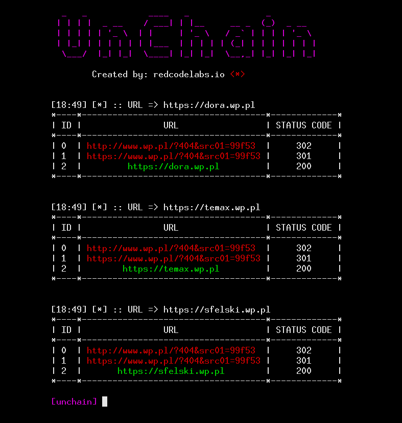

<h1 align="center"> UnChain </h1>  

  

  A tool to find redirection chains in multiple URLs

## Introduction

  UnChain automates process of finding and following `30X` redirects by extracting "Location" header of HTTP responses.

## Usage

usage: unchain [-h|--help] -u|--url "<value>"

Arguments:

  -h  --help  Print help information
  -u  --url   File containing urls or a single url

